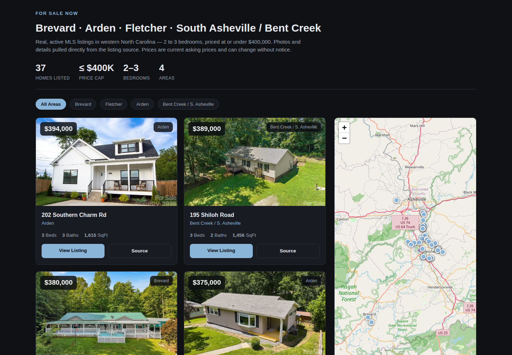

# Home for Sale — WNC Homes Under $400K

A fast, single-file reference site for home listings in Western North Carolina. It surfaces **140 live homes under $400K** (2–3 bedroom) across **Brevard · Arden · Fletcher · South Asheville / Bent Creek**, each with a photo, price, specs, and a link back to the original brokerage listing — plus an interactive Leaflet map.

Private GitHub Pages site, built locally from the Canopy MLS feeds.

**Live site:** [jacoblbagent.github.io/home-for-sale](https://jacoblbagent.github.io/home-for-sale)



## Features

- **Interactive Leaflet map** (OpenStreetMap) that spans the window height on desktop, synced with the card grid
- **Area filter chips** — filter by area or view all; markers recolor, and the selected area is outlined while others dim but stay visible for location context
- **Sort dropdown** — price / beds / sq ft, ascending or descending; combines with the area filter
- **Card ↔ map sync** — click a card to focus & pop its marker; click a marker for a listing popup with photo and specs
- **Terse chrome** — small border radii, live home count inline with the filters (no separate stats row), minimal header
- Each card's **Source** button opens the original brokerage listing page
- Dark, clean UI, fully responsive down to mobile

## Areas & current counts

| Area | Listings |
|------|----------|
| Fletcher | 54 |
| Arden | 40 |
| Brevard | 34 |
| Bent Creek / S. Asheville | 12 |
| **Total** | **140** |

## How it works

A single `index.html` holds a `HOMES` array (address, lat/lng, beds/baths/sq ft, price, source, image, listing URL). Rendering, filtering, sorting, markers, and popups are all client-side vanilla JS — no build step, no backend. GitHub Pages serves it as-is.

## Listing data

Content is fed to the Canopy MLS feed and served by two Asheville-area brokers:

- [Mosaic Realty (Asheville)](https://mymosaicrealty.com)
- [Noble & Company Realty](https://nc-realty.com)

Every card links to the original listing page. Listings and photos are reviewed/refreshed periodically in the repo.

## Running locally

Because cards use relative image paths, open `index.html` from the project root, or serve the folder:

```bash
# from the repo root
python3 -m http.server 8080
# then visit http://localhost:8080
```

## Disclaimer

Prices and availability change frequently and are supplied by the brokerage feeds. Verify with your agent before making an offer. This page is a locally-generated reference, not an official brokerage service.